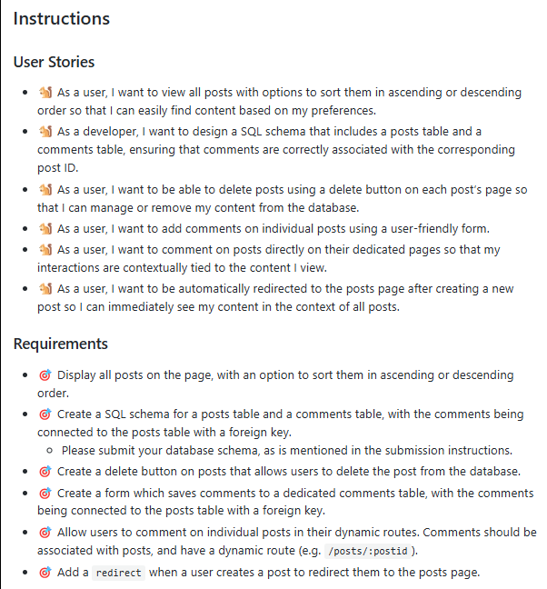
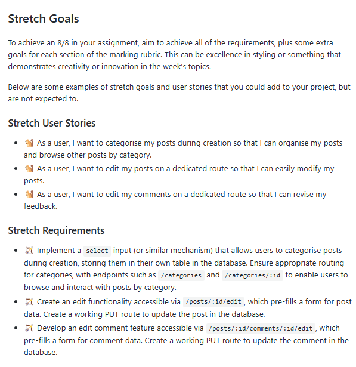

## ##Build a Blog with a Comments Form

---

## 

##**Reflection**

Please also provide an assignment reflection in your project README.md file.

_Required_

🎯 What requirements did you achieve?

🎯 Were there any requirements or goals that you were unable to achieve?

🎯 If so, what was it that you found difficult about these tasks?

_Optional_

🏹 Feel free to add any other reflections you would like to share about your submission, for example:

🎯 Requesting feedback about a specific part of your submission.

🎯 What useful external sources helped you complete the assignment (e.g Youtube tutorials)?

🎯 What errors or bugs did you encounter while completing your assignment? How did you solve them?

🎯 What went really well and what could have gone better?
